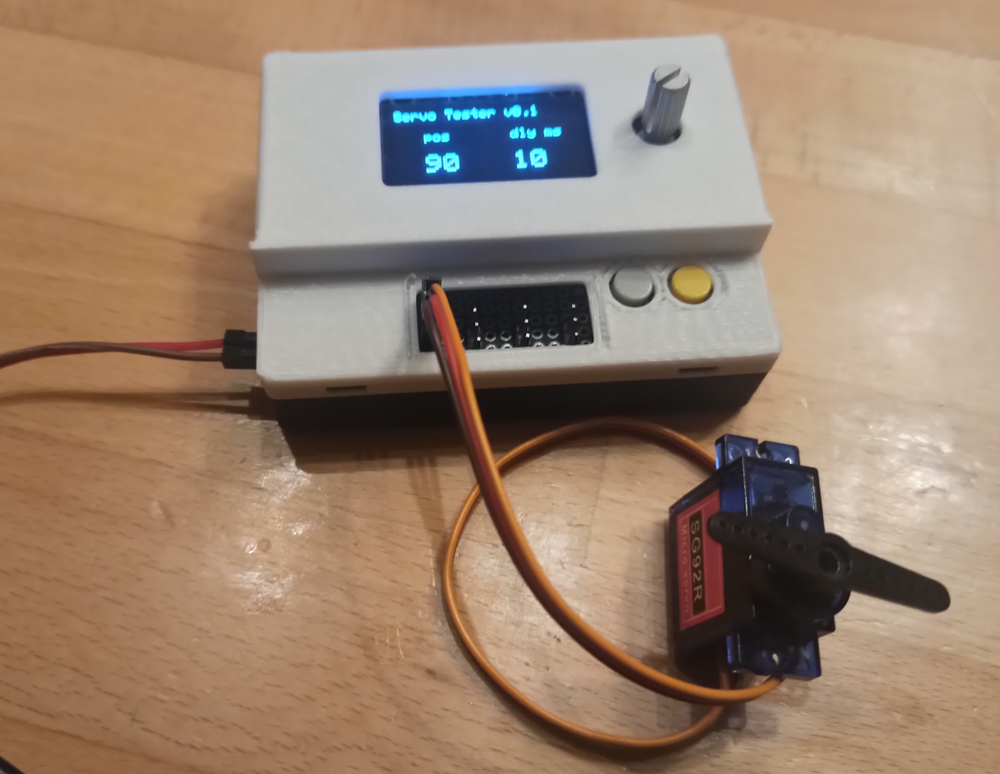
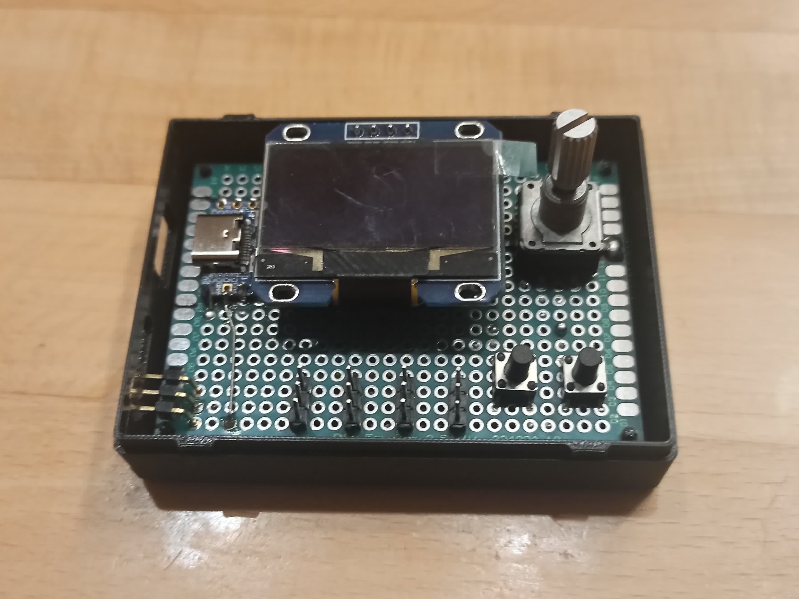

# Introduction

An ESP32-S3 based Servo Tester.

# Hardware

* Waveshare ESP32-S3 Zero
* 1.3" OLED Display SSH1106
* Rotary Encoder with button
* 5 x 3x1 pin header 

# Software

* Arduino IDE 2.x
* Espressif ESP32 board library
* Adafruit_GFX library
* Adafruit_SH110x library
* s3servo library https://github.com/Rob58329/ESP32S3servo.git
*  Encoder library https://github.com/PaulStoffregen/Encoder
